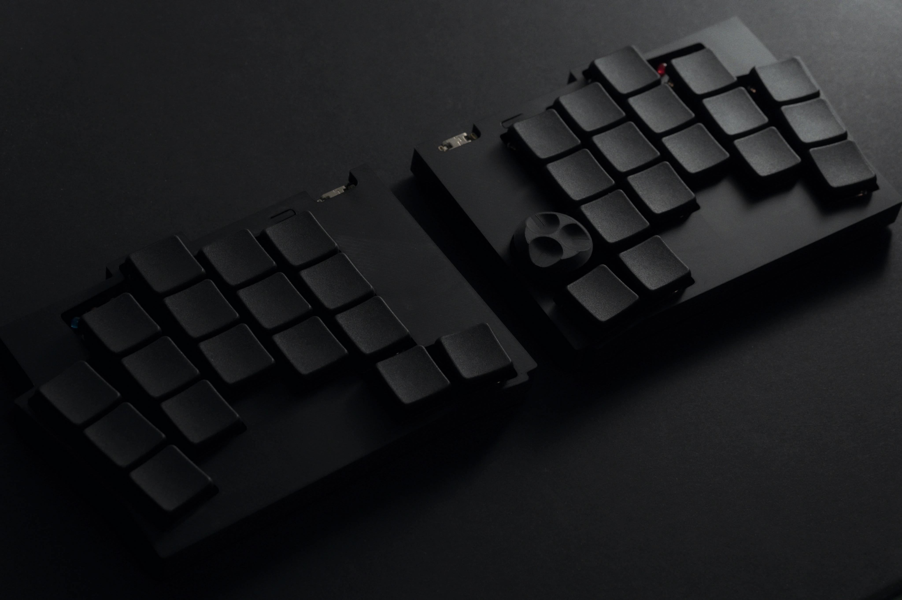
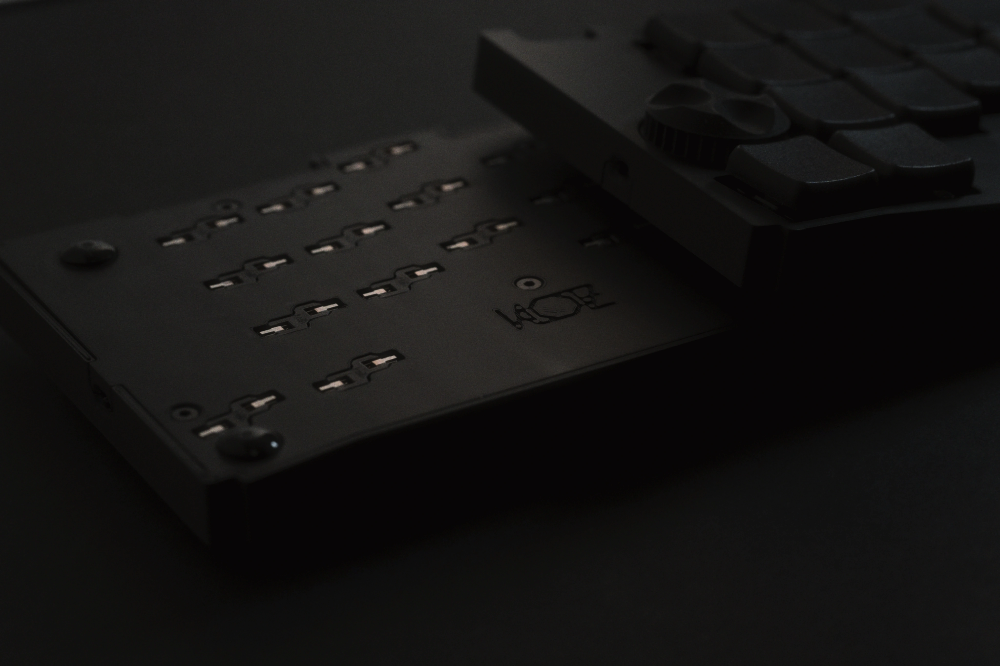
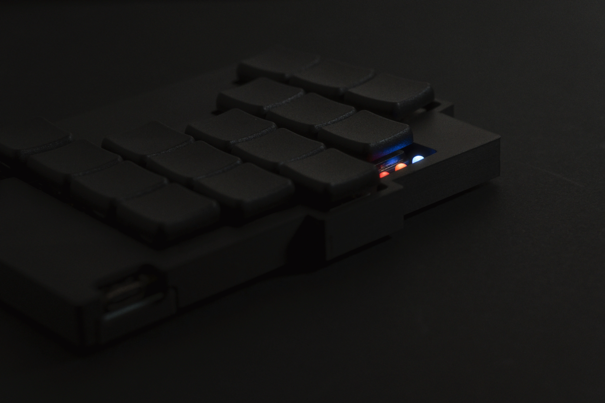
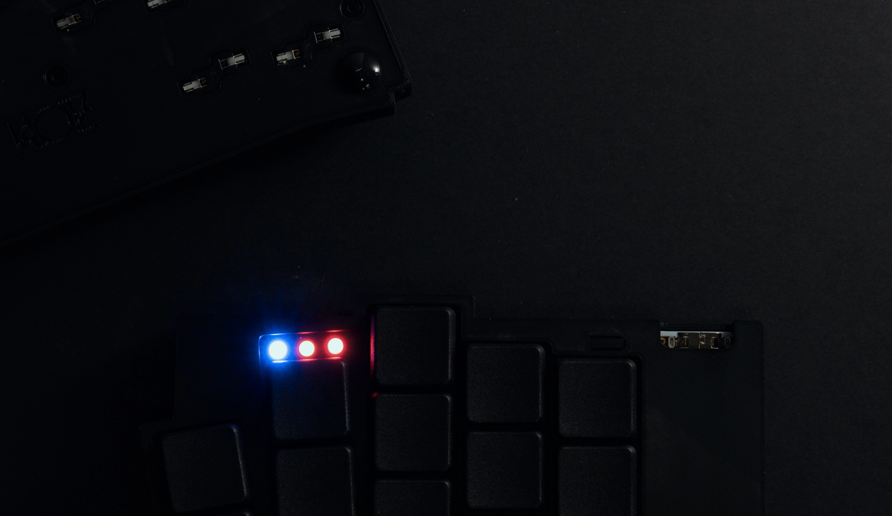
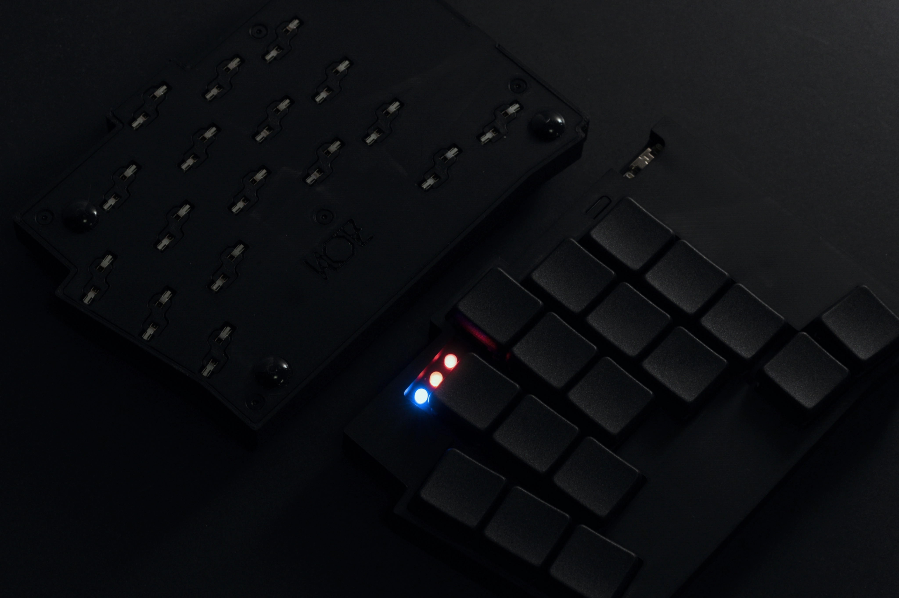
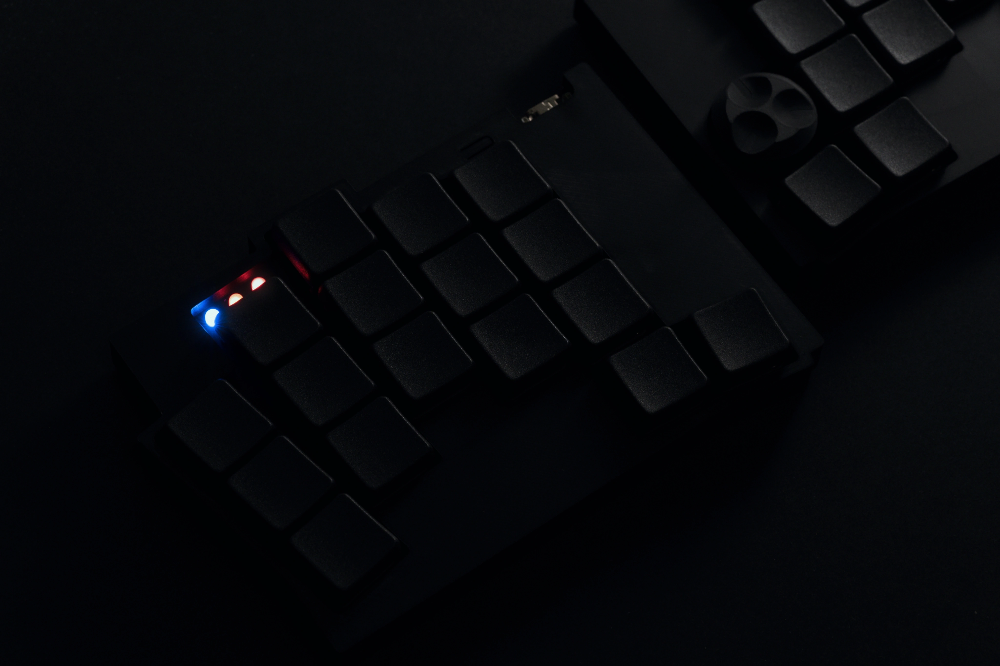
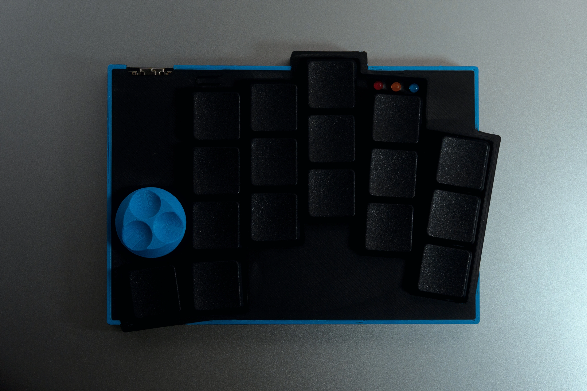
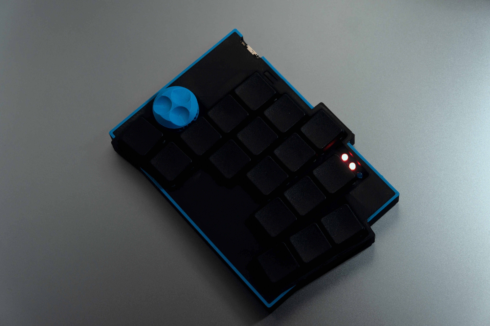

# KLOTZ CASE

A fully compatible replacement case for the [**KLOTZ** by **GEIST**](https://github.com/GEIGEIGEIST/KLOTZ), The design was inspired by GEIST’s iconic keyboard, [TOTEM](https://github.com/GEIGEIGEIST/TOTEM).

This case is designed primarily for **FDM 3D printing**, though other methods and materials should also work without issues.

+ Added V2 files for Kailh Choc V2 switches, as the switch size differs.

## Encoder Knob Compatibility

The encoder knob was **tested and designed exclusively for GEIST’s original KLOTZ knob**.
If you plan to use a different knob, make sure its **diameter does not exceed 22 mm**.

## FDM Printing

There are no special requirements for printing.
Just make sure you correctly orient the model so that the proper surface faces the build plate.

All test prints using:
- 0.4 mm nozzle
- 0.18 mm layer height
- BBL PLA Matte Black
- BBL Smooth PEI Plate

For screw mounting, friction-fit holes sized **1.9 mm** are provided for **M2 screws**.
Accurate wall thickness and print precision are important for proper fit.

Supports can be used when printing the **bottom case** if you want.

> [!TIP]
> Recommended 100% Infill ratio for the plate and the bottom case.

## Assembly

You’ll need:
- **10x countersunk M2x8 mm screws**
- **Rubber feet** up to **9 mm** Diameter

The **original plate** is **not compatible** with this case. print the provided **plate file** separately.

Before assembly, **trim any protruding legs (ex: encoder pins)** using flush cutters, as they may interfere with case clearance.

The battery height is recommended to be no more than 4.6 mm.

##  Files

All STEP files are located in the steps directory.
> [!TIP]
> Except for the bottom case, each part can be mirrored for left or right hand use.

- ### V1 Files

| File | Description |
|------|--------------|
| `R_BOTTOM.step` | Right bottom case |
| `L_BOTTOM.step` | Left bottom case |
| `TOP.step` | top case (without encoder), mirror if needed |
| `TOP_ENCODER.step` | top case (with encoder), mirror if needed |
| `PLATE.step` | Plate (mirror if needed) |

- ### V2 Files

| File | Description |
|------|--------------|
| `R_BOTTOM underswitch.step` | Right bottom case with under-mounted switch |
| `L_BOTTOM underswitch.step` | Left bottom case with under-mounted switch  |
| `TOP underswitch.step` | top case (without encoder), with under-mounted switch, mirror if needed |
| `TOP_ENCODER.step` | top case (with encoder), with under-mounted switch, mirror if needed |
| `V2 PLATE.step` | Plate for choc V2 switches (mirror if needed) |
| `V2 PLATE no LED.step` | Plate for choc V2 switches (without LEDs) (mirror if needed) |

## Photos

### Variant Demo

Multi-color printing with the original outlines.

